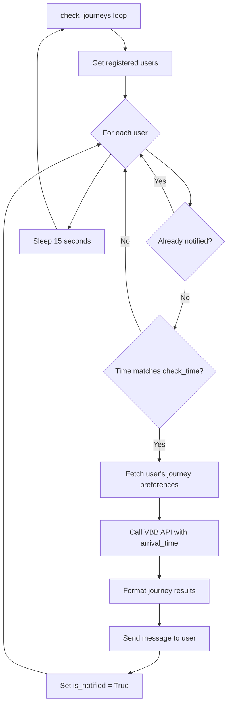

## Overview

The bot runs two background services for automated journey notifications:

1. **Journey checker**: Continuous loop checking for users who need notifications
2. **APScheduler jobs**: Cron-based tasks for daily maintenance

Both services start automatically when the bot launches in `app/__main__.py:92`:

```python
# Start journey checker loop
from app.vbb.service.checker import check_journeys
asyncio.create_task(check_journeys())

# Start APScheduler
from app.utils import add_scheduler_jobs
await add_scheduler_jobs()

await app.dp.start_polling(app.bot)
```

## Journey checker service

The journey checker runs continuously, monitoring users for scheduled notifications.

### Implementation

Defined in `app/vbb/service/checker.py:18`:

```python
async def check_journeys():
    while True:
        async with sessionmanager() as session:
            users: list[User] = await session.get_registered_users()

            for user in users:
                logging.debug("checking user: %s" % user)
                if user.is_notified:
                    continue

                if not is_time_matching(user.check_time):
                    continue

                # Start journey dialog for user
                await start_dialog(states.JourneysSG.MAIN, user.id, now=False)

                # Mark user as notified
                await session.update_notified(user, True)

        await asyncio.sleep(15)
```

### How it works

1. **Infinite loop**: Runs continuously while bot is active
2. **Fetch registered users**: Gets all users with home and destination addresses configured
3. **Check notification status**: Skip users who already received today's notification
4. **Time matching**: Check if current time matches user's `check_time`
5. **Launch dialog**: Start journey dialog with user's saved preferences
6. **Mark notified**: Set `is_notified = True` to prevent duplicate notifications
7. **Sleep**: Wait 15 seconds before next check

### Time matching logic

```python
def is_time_matching(check_time: time):
    now = datetime.now().time()
    return all([now.hour == check_time.hour,
                now.minute == check_time.minute])
```

- Compares current hour and minute with user's `check_time`
- Granularity: 1 minute
- Timezone: Uses system timezone (should be Europe/Berlin)

### Background dialog launching

Notifications are sent by programmatically starting a dialog:

```python
async def start_dialog(state: State, user_id, **kwargs):
    from aiogram_dialog.manager.bg_manager import BgManager
    from aiogram.types import Chat, User as TgUser
    from aiogram_dialog import StartMode, ShowMode
    from app import bot, dp
    
    user = TgUser(id=user_id, is_bot=False, first_name="test")
    chat = Chat(id=user_id, type="private")
    manager = BgManager(user=user, chat=chat, bot=bot, router=dp, intent_id=None, stack_id="")
    await manager.start(state, mode=StartMode.RESET_STACK, show_mode=ShowMode.SEND, data=kwargs)
```

This creates:
- **Fake user and chat objects**: Required by aiogram-dialog
- **Background manager**: Special dialog manager for non-interactive launches
- **Dialog start**: Launches `JourneysSG.MAIN` dialog with `now=False` parameter

### Journey notification flow



### Notification message

The journey dialog getter in `app/dialogs/journeys.py:17` fetches journeys:

```python
async def paging_getter(dialog_manager: DialogManager, **_kwargs):
    user_id = dialog_manager.event.from_user.id
    f: FMT = dialog_manager.middleware_data.get("f")
    
    if f is None:
        async with sessionmanager() as session:
            user = await session.get_user(user_id)
            home_address = await session.get_address(user.home_address_id)
            destination_address = await session.get_address(user.default_destination_address_id)
    else:
        user = await f.db.get_user(user_id)

    start_data = dialog_manager.start_data
    now = start_data.get("now", True) if start_data else True

    # Fetch journeys with arrival time
    data = await get_journeys(user, session, now=now)

    journey = data[current_page]

    return {
        "pages": len(data),
        "current_page": current_page + 1,
        "journey_information": await message_builder.build_journey_text(journey)
    }
```

Key points:
- `now=False` means journeys are calculated to arrive at user's `arrival_time`
- User can paginate through multiple journey options
- Formatted message includes departure/arrival times, lines, transfers

## APScheduler jobs

APScheduler handles periodic maintenance tasks.

### Initialization

Defined in `app/utils/scheduler_jobs.py:1`:

```python
async def add_scheduler_jobs():
    from app import scheduler
    from app.vbb.service import remove_is_notified

    from apscheduler.triggers.cron import CronTrigger

    scheduler.add_job(remove_is_notified, CronTrigger(hour=0, minute=0))

    scheduler.start()
```

### Scheduler instance

Created in `app/__init__.py:23`:

```python
from apscheduler.schedulers.asyncio import AsyncIOScheduler

scheduler = AsyncIOScheduler()
```

- **Type**: AsyncIOScheduler (integrates with asyncio event loop)
- **Timezone**: Uses system timezone
- **Persistence**: Jobs lost on restart (in-memory only)

## Daily notification reset job

Resets the `is_notified` flag for all users at midnight.

### Implementation

Defined in `app/vbb/service/checker.py:51`:

```python
async def remove_is_notified():
    async with sessionmanager() as session:
        users: list[User] = await session.get_registered_users()
        for user in users:
            await session.update_notified(user, False)
```

### Schedule

```python
CronTrigger(hour=0, minute=0)
```

- **Frequency**: Daily
- **Time**: 00:00 (midnight)
- **Timezone**: System timezone (should be Europe/Berlin)

### Purpose

Ensures users receive exactly **one notification per day**:

```
06:30 - User's check_time reached, is_notified = False
      → Send notification
      → Set is_notified = True
06:30 - check_time still matches, but is_notified = True
      → Skip (no duplicate notification)
00:00 - Daily reset job runs
      → Set is_notified = False for all users
06:30 - Next day: User receives notification again
```

## Error handling and recovery

### Database connection errors

```python
async with sessionmanager() as session:
    try:
        users = await session.get_registered_users()
    except Exception as e:
        logging.error(f"Database error: {e}")
        # Session rolled back automatically
```

The async context manager ensures:
- **Automatic rollback** on errors
- **Connection cleanup** after each iteration
- **No zombie connections** from crashes

### VBB API errors

If the VBB API is unavailable:

```python
try:
    journeys = await get_journeys(user, session, now=False)
except aiohttp.ClientError as e:
    logging.error(f"VBB API error for user {user.id}: {e}")
    # User not marked as notified, will retry in 15 seconds
```

- **No retry limit**: Will keep attempting until API recovers
- **User experience**: May receive delayed notification
- **No data loss**: notification flag only set after successful send

### Bot restart behavior

**Journey checker**:
- Restarts immediately with bot
- Catches up on any missed notifications within 15 seconds
- No persistent state needed

**APScheduler**:
- Jobs recreated on startup
- Missed jobs are **not** executed retroactively
- If bot restarted during midnight reset, `is_notified` flags remain until next midnight

## Performance considerations

### Database queries

Each check cycle (15 seconds):
- **1 query**: Fetch all registered users
- **N queries**: Update each notified user (worst case: all users)

For 1000 users all receiving notifications at the same time:
- 1001 queries in one cycle
- ~15ms per query = ~15 seconds total
- May slow down notification delivery

### Optimization strategies

**Batch updates**:
```python
# Instead of individual updates
await session.update_notified(user, True)

# Batch update all notified users
notified_user_ids = [user.id for user in notified_users]
await session.execute(
    update(User)
    .where(User.id.in_(notified_user_ids))
    .values(is_notified=True)
)
```

**Index on check_time**:
```sql
CREATE INDEX idx_users_check_time ON users(check_time) WHERE is_notified = false;
```

### VBB API rate limits

**Limit**: 100 requests per minute

If 100+ users have the same `check_time`:
- All requests sent in one 15-second cycle
- May exceed rate limit
- Some users receive HTTP 429 errors

**Solution**: Stagger notifications:
```python
for i, user in enumerate(users):
    await start_dialog(states.JourneysSG.MAIN, user.id, now=False)
    if i % 10 == 0:
        await asyncio.sleep(1)  # Pause every 10 users
```

## Monitoring and observability

### Logging

The journey checker logs every user check:

```python
logging.debug("checking user: %s" % user)
```

In production, monitor:
- **Notification count per cycle**: Track how many users notified
- **API error rate**: Watch for VBB API failures
- **Database query time**: Detect performance degradation

### Health checks

Add a health check endpoint:

```python
@app.router.get("/health")
async def health_check():
    return {
        "status": "ok",
        "journey_checker_running": check_journeys_task.done() == False,
        "scheduler_running": scheduler.running
    }
```

## Testing background services

### Manual testing

1. **Set check_time to current time**:
   ```sql
   UPDATE users SET check_time = '14:30:00', is_notified = false WHERE id = YOUR_USER_ID;
   ```

2. **Watch logs**:
   ```bash
   python -m app --test
   # Wait until 14:30:00
   # Should see notification arrive
   ```

3. **Verify no duplicate**:
   ```sql
   SELECT is_notified FROM users WHERE id = YOUR_USER_ID;
   -- Should be TRUE
   ```

### Automated testing

```python
import pytest
from datetime import time
from app.vbb.service.checker import is_time_matching

def test_time_matching():
    # Mock current time to 08:30
    with mock_time("08:30:00"):
        assert is_time_matching(time(8, 30)) == True
        assert is_time_matching(time(8, 31)) == False
        assert is_time_matching(time(9, 30)) == False
```

## Future enhancements

### Journey change detection

Monitor journeys for changes (delays, cancellations):

```python
async def monitor_journeys():
    while True:
        users = await session.get_users_with_saved_journeys()
        for user in users:
            saved_journey = await session.get_saved_journey(user.id)
            current_journey = await refresh_journey(saved_journey.refresh_token)
            if journey_changed(saved_journey, current_journey):
                await notify_user(user.id, "Your journey has changed!")
        await asyncio.sleep(60)
```

### Multiple daily notifications

Support multiple notification times per user:

```python
class UserNotificationTime(Base):
    user_id = Column(BigInteger, ForeignKey('users.id'))
    check_time = Column(Time)
    day_of_week = Column(Integer)  # 0=Monday, 6=Sunday
    is_notified = Column(Boolean, default=False)
```

### Notification preferences

Allow users to customize notification content:

```python
class UserPreferences(Base):
    user_id = Column(BigInteger, ForeignKey('users.id'))
    notify_on_delay = Column(Boolean, default=True)
    notify_on_cancellation = Column(Boolean, default=True)
    min_delay_minutes = Column(Integer, default=5)
```

## Next steps

<CardGroup cols={2}>
  <Card title="Architecture overview" icon="diagram-project" href="/development/overview">
    Review the complete system architecture
  </Card>
  <Card title="Database schema" icon="database" href="/development/database-schema">
    Understand the data model for users and journeys
  </Card>
</CardGroup>